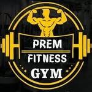
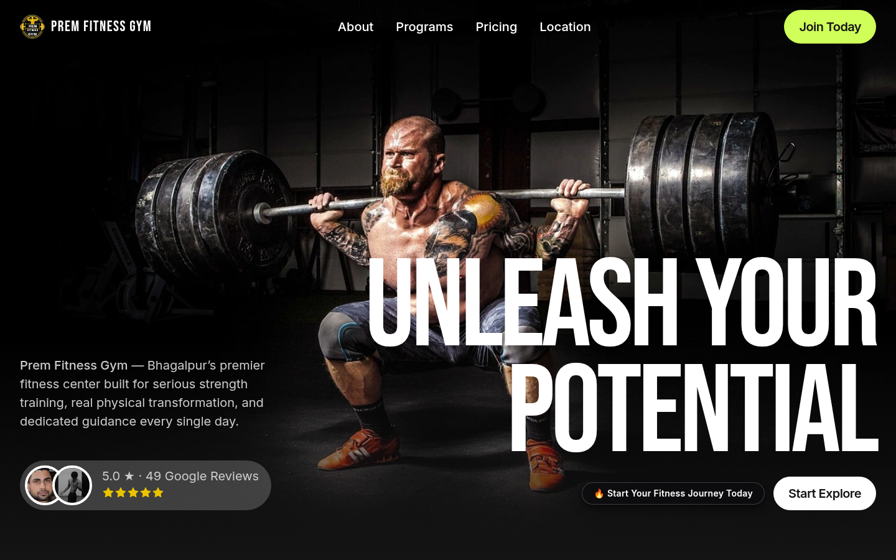
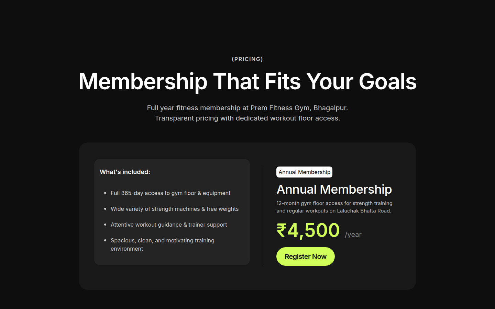
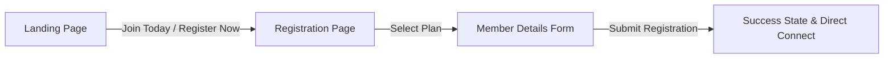
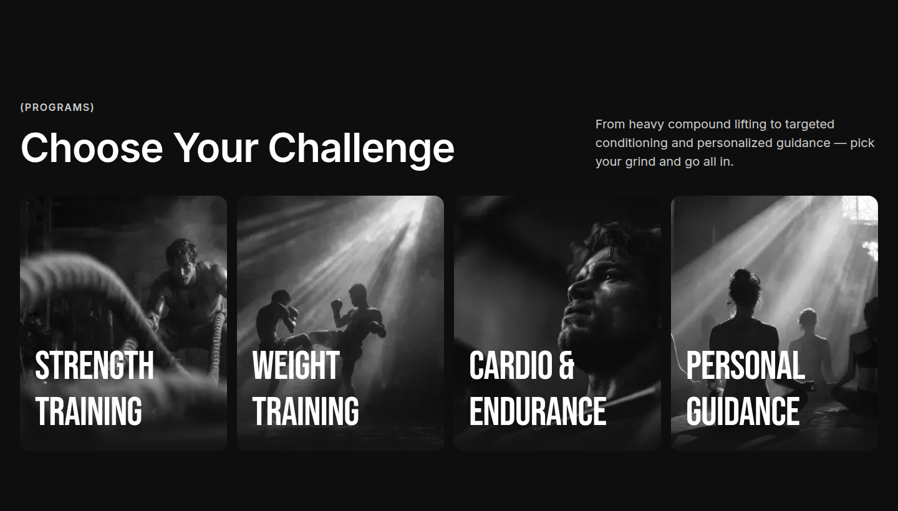
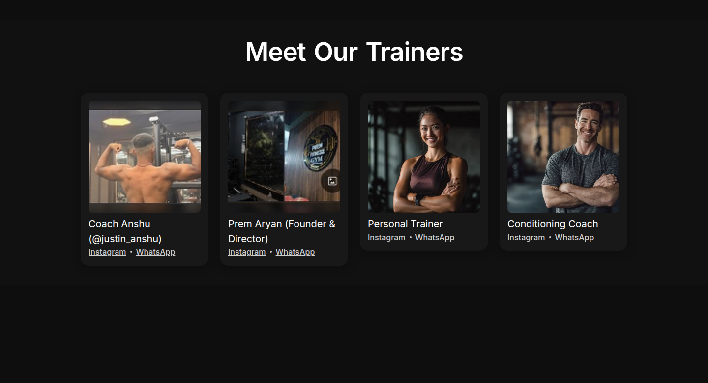
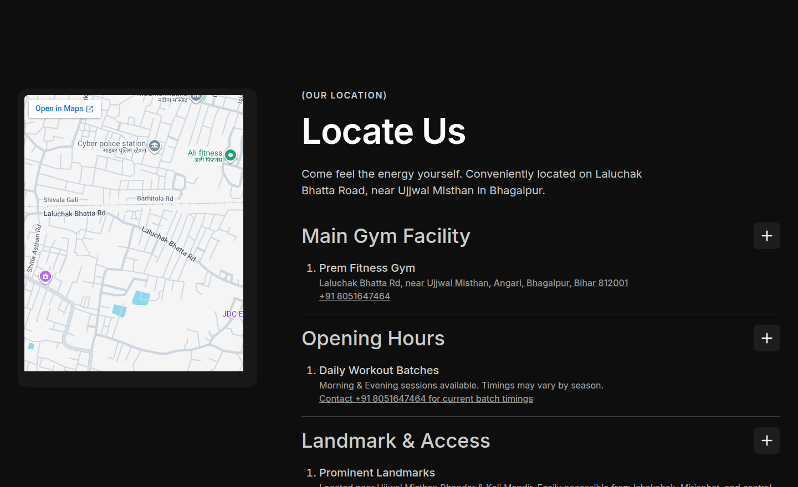
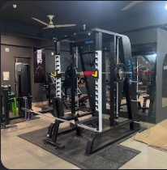
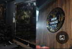

<div align="center">
  

  # PREM FITNESS GYM

  ### Premium Fitness Website — Bhagalpur, Bihar
  **A high-impact, conversion-focused digital experience built for Prem Fitness Gym.**

  > 🌐 **Live Site:** https://mohitraj8503.github.io/Prem-Fitness-Gym/ — Custom domain removed. Default GitHub Pages URL is canonical.

  <p>
    <a href="https://maps.google.com/maps?q=Prem+Fitness+Gym,+Laluchak+Bhatta+Rd,+near+Ujjwal+Misthan,+Angari,+Bhagalpur,+Bihar+812001"></a>
    <a href="https://www.instagram.com/premfitnessgym/"></a>
    <a href="https://wa.me/918051647464"></a>
    
  </p>

  <p>
    <a href="#-about-the-project">About</a> •
    <a href="#-website-highlights">Highlights</a> •
    <a href="#-screenshots">Screenshots</a> •
    <a href="#-membership-registration">Registration</a> •
    <a href="#-pricing">Pricing</a> •
    <a href="#-technology-stack">Tech Stack</a> •
    <a href="#-local-development">Setup</a> •
    <a href="#-contact--location">Contact</a>
  </p>

  <br/>

  
</div>

---

# ✦ About the Project

**Prem Fitness Gym** is a digital brand experience crafted to bring Bhagalpur’s premier fitness destination into a modern, high-performance web environment. The platform blends an editorial dark fitness aesthetic with fluid motion, clear pricing hierarchy, verified gym imagery, and a direct registration flow.

The entire interface is architected around one core principle:

> **"Strong brand. Verified information. Zero friction from discovery to registration."**

### Core Highlights:
- **Zero Fiction / 100% Verified**: Authentic photography, real Google reviews (5.0★ · 49 reviews), and actual facility features on Laluchak Bhatta Road.
- **Dedicated Conversion Funnel**: Direct routes to membership registration rather than dead-end anchor scrolling.
- **Micro-Interactions & Motion**: Smooth entrance choreography, custom interactive modals, and responsive layout scaling.

---

# ✦ Brand Identity

<div align="center">
  

  ### PREM FITNESS GYM
  **Laluchak Bhatta Road, near Ujjwal Misthan, Angari, Bhagalpur, Bihar 812001**
  
  *Discipline • Strength • Progress*
</div>

The website strictly adheres to Prem Fitness Gym’s visual identity:
- **Official Brand Mark**: Circular emblem featuring the gold barbell crest and bold typography.
- **Color Architecture**: Deep matte obsidian `#0e0e0e`, slate glass `#1c1c1f`, crisp stark white `#ffffff`, and electric neon accents `#d4ff00` for high-impact CTAs.
- **Editorial Typography**: High-impact condensed display typeface (`Bebas Neue`) paired with geometric body sans.

---

# ✦ Experience & Design System

The digital experience is built around a performance-focused visual system:
- **High-Contrast Typography**: Clear ocular hierarchy distinguishing section headers, badges, and body content.
- **Fluid Scroll Interactions**: Sections gracefully reveal on viewport entry.
- **Interactive Modals**: Custom animated "Why Prem Fitness?" modal engineered with high-precision vector SVG badges and clean dismissal mechanics.
- **Glassmorphism Badges**: Custom frosted glass pill badges (`backdrop-filter: blur(14px)`) ensuring legibility across varying viewports.
- **Touch-Optimized Mobile Experience**: Intelligent column re-ordering (`order: 1` on pricing and CTA on mobile viewports).

---

# ✦ Website Highlights

### ◉ Hero Experience
A bold opening presentation communicating the gym's real identity:
- **Backdrop**: Dynamic compound squat imagery anchored with dark vignette gradients.
- **Social Proof Badge**: Real member review avatars with live verified rating badge: `5.0 ★ · 49 Google Reviews`.
- **Navigation**: Instant access to `About`, `Programs`, `Pricing`, `Location`, and the prominent `Join Today` CTA button.

---

### ◉ Social Connect Strip
Directly below the hero, a dedicated social hub provides single-click access to verified channels:
- **Instagram**: One-touch icon link directly to [@premfitnessgym](https://www.instagram.com/premfitnessgym/).
- **WhatsApp (Line 1)**: Quick chat initiation with `+91 8051647464`.
- **WhatsApp (Line 2)**: Secondary direct line for admissions: `+91 8863865036`.
- **Facebook**: Official Facebook presence integration.

---

### ◉ Programs & Training
Discoverable training categories structured around actual equipment and facilities:
1. **Strength Training**: Heavy compound lifting, smith machines, power racks.
2. **Weight Training**: Plate-loaded machinery, ergonomic benches, dumbbells.
3. **Cardio & Endurance**: High-intensity conditioning and aerobic capacity.
4. **Personal Guidance**: Attentive form correction and structured progressions led by certified coaches.

---

### ◉ Verified Trainers
Trainers are presented strictly using authentic, publicly verifiable records:
- **Coach Anshu** (`@justin_anshu`) — Head Trainer & Workout Coach
- **Prem Aryan** — Founder & Director
- Direct WhatsApp & Instagram links for direct personal training consultations.

---

### ◉ Authentic Member Reviews & Facilities
Authentic customer feedback sourced directly from verified Google reviews:
- **Rishabh Anand**: *"Great gym with excellent equipment, a clean environment, and supportive trainers."*
- **Art Animesh**: *"Great gym with quality equipment and a supportive environment. The trainer @justinanshu is knowledgeable."*
- **Gulshan Kumar**: *"Amazing vibe, clean space, great crowd, high energy, and complete value for money."*
- **Shirsh Raj**: *"Good facility, proper machinery and lively environment."*
- **Satyam Shandilya**: *"Wonderful experience coming here and doing exercise... More grateful to trainer @justin_anshu."*

---

# ✦ Pricing

The pricing architecture presents transparent membership value with balanced columns and an instant action trigger:

<div align="center">
  
</div>

### Annual Membership Details:
- **Fee**: **₹4,500 / year** (Transparent, all-inclusive gym floor access)
- **What's Included**:
  - Full 365-day access to gym floor & equipment
  - Wide variety of strength machines & free weights
  - Attentive workout guidance & trainer support
  - Spacious, clean, and motivating training environment
- **Conversion Flow**: Clicking **Register Now** routes straight to `register.html`.

---

# ✦ Membership Registration Flow

The project includes a standalone, beautifully branded registration interface at `register.html`.



### Visual Representation of Funnel:
```text
Landing Page (index.html)
       │
       ├──> "Join Today" (Navbar CTA)
       └──> "Register Now" (Pricing Card CTA)
              │
              ▼
Registration Page (register.html)
       │
       ├──> Plan Selection (Annual Membership — ₹4,500/year)
       ├──> Personal Details (Full Name, WhatsApp Number, Email, Address)
       │
       ▼
Success Confirmation
       │
       ├──> Confirmation Dialogue
       └──> Instant WhatsApp Verification
```

---

# ✦ Screenshots

### 🖥️ Hero Experience
<div align="center">
  
</div>

### 🏋️ Programs & Disciplines
<div align="center">
  
</div>

### 💳 Membership & Transparent Pricing
<div align="center">
  
</div>

### 🥊 Trainers & Coaching Staff
<div align="center">
  
</div>

### 📍 Location & Interactive Direct Directory
<div align="center">
  
</div>

---

# ✦ Facility & Equipment Gallery

<div align="center">
  <table>
    <tr>
      <td align="center">
        <br/>
        <b>Strength & Cable Machinery</b>
      </td>
      <td align="center">
        <br/>
        <b>Workout & Physique Floor</b>
      </td>
      <td align="center">
        <br/>
        <b>Interior Brand Emblem</b>
      </td>
    </tr>
  </table>
</div>

---

# ✦ Technology Stack

The project is built on modern, ultra-lightweight web standards ensuring near-instantaneous load times and seamless cross-platform rendering:

| Layer | Technology | Description |
|---|---|---|
| **Markup** | HTML5 Semantic | Optimized DOM tree with accessibility labels and meta tags |
| **Styling** | CSS3 & Custom Grid | Responsive design system, CSS variables, glassmorphism, flexbox |
| **Interactions** | Vanilla JS + Webflow JS + jQuery | Micro-interactions, custom modal controllers, smooth view transitions |
| **Fonts** | Google Fonts | `Bebas Neue` (display headings) & modern Sans-serif |
| **Vector Assets** | Inline SVG / Ikonik | High-DPI, zero-pixelation scalable iconography |
| **Image Compression** | WebP & PNG | Multi-density responsive `srcset` (500w, 800w, 1080w, 1232w) |

---

# ✦ Project Structure

```text
Prem-Fitness-Gym/
├── index.html                   # Main landing page
├── register.html                # Dedicated registration page
├── css/
│   ├── liftline-template.webflow.shared.9a17459c3.min.css
│   └── webflow-style.css
├── js/
│   ├── jquery.js                # Core runtime
│   ├── webflow-script.js        # Interaction engine
│   └── webflow.schunk.*.js      # Animation bundles
├── images/                      # Core production media assets
│   ├── prem_fitness_logo.png
│   ├── hero.webp
│   ├── prem_gym_equipment.webp
│   ├── prem_gym_training.webp
│   └── ...
├── assets/                      # Showcase & documentation assets
│   ├── prem-fitness-gym-logo.png
│   ├── preview/
│   │   ├── hero.png             # Full-width hero preview
│   │   ├── programs.png         # Programs grid preview
│   │   ├── pricing.png          # Balanced pricing card preview
│   │   ├── trainers.png         # Coaching roster preview
│   │   └── location.png         # Map & accordion directory preview
│   ├── gym/
│   │   ├── gym-01.jpg           # Facility equipment
│   │   ├── gym-02.jpg           # Workout floor
│   │   └── gym-03.jpg           # Interior emblem
│   └── trainers/
│       ├── trainer-01.jpg       # Coach Anshu
│       └── trainer-02.jpg       # Prem Aryan
└── README.md                    # Agency-grade repository documentation
```

---

# ✦ Local Development

### 1. Clone the Repository
```bash
git clone https://github.com/YOUR-USERNAME/Prem-Fitness-Gym.git
cd Prem-Fitness-Gym
```

### 2. Launch Local Server

**Using Python:**
```bash
python3 -m http.server 5500
```
Then visit [`http://localhost:5500`](http://localhost:5500) in your browser.

**Using Node.js (`serve` or `npx http-server`):**
```bash
npx http-server -p 5500
```

**Using VS Code:**
- Install the **Live Server** extension.
- Right-click `index.html` → Click **"Open with Live Server"**.

---

# ✦ Authenticity Guarantee

This project is built around verifiable ground truth:

```text
┌───────────────────────────────────────┬───────────────────────────────────────┐
│              WE PREFER                │              WE AVOID                 │
├───────────────────────────────────────┼───────────────────────────────────────┤
│  ✓ Authentic facility photography     │  ✗ Stock photos of unrelated gyms     │
│  ✓ Verified Google Maps location      │  ✗ Fabricated customer stories        │
│  ✓ Official social profiles           │  ✗ Fictional coaches or credentials   │
│  ✓ Real 5.0★ Google ratings           │  ✗ Made-up transformation stats       │
│  ✓ Transparent ₹4,500/year rate       │  ✗ Hidden fees or dummy pricing       │
└───────────────────────────────────────┴───────────────────────────────────────┘
```

---

# ✦ Contact & Location

<div align="center">
  <h3>PREM FITNESS GYM</h3>
  <p><b>Laluchak Bhatta Rd, near Ujjwal Misthan, Angari, Bhagalpur, Bihar 812001</b></p>

  <p>
    <b>Phone:</b> <a href="tel:+918051647464">+91 8051647464</a> &nbsp;•&nbsp;
    <b>WhatsApp 1:</b> <a href="https://wa.me/918051647464">8051647464</a> &nbsp;•&nbsp;
    <b>WhatsApp 2:</b> <a href="https://wa.me/918863865036">8863865036</a>
  </p>

  <p>
    <b>Instagram:</b> <a href="https://www.instagram.com/premfitnessgym/">@premfitnessgym</a> &nbsp;•&nbsp;
    <b>Facebook:</b> <a href="https://www.facebook.com/prem.aryan.686036/">Prem Fitness Gym</a>
  </p>

  <br/>

  <a href="https://maps.google.com/maps?q=Prem+Fitness+Gym,+Laluchak+Bhatta+Rd,+near+Ujjwal+Misthan,+Angari,+Bhagalpur,+Bihar+812001">
    
  </a>
</div>

---

# ✦ Credits & License

- **Design & Architecture**: Crafted for **Prem Fitness Gym**, Bhagalpur, Bihar.
- **Base Architecture**: Liftline Webflow HTML Engine.
- **Intellectual Property**: All Prem Fitness Gym trademarks, branding, logos, and gym photography remain the property of Prem Fitness Gym.

<div align="center">
  <br/>
  
  <br/><br/>
  <b>PREM FITNESS GYM — BHAGALPUR</b><br/>
  <i>Discipline • Strength • Progress</i><br/><br/>
  <sub>© 2026 Prem Fitness Gym. All rights reserved.</sub>
</div>
